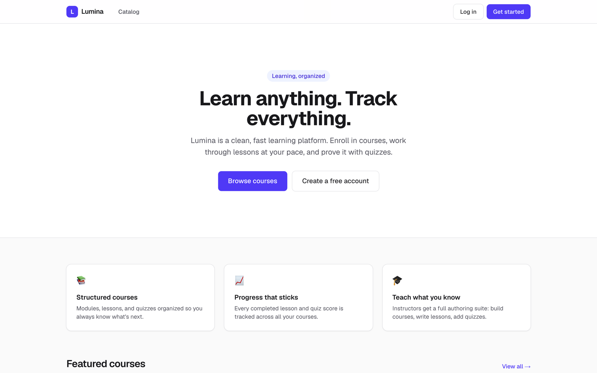
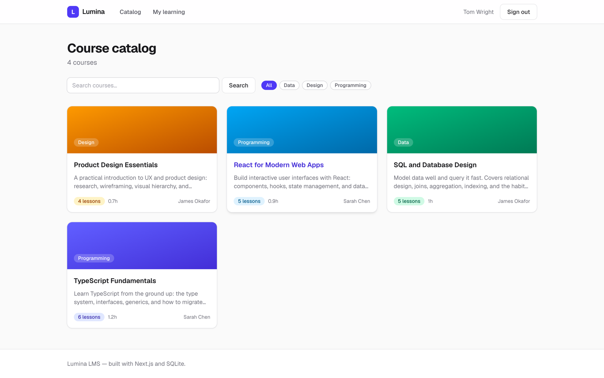
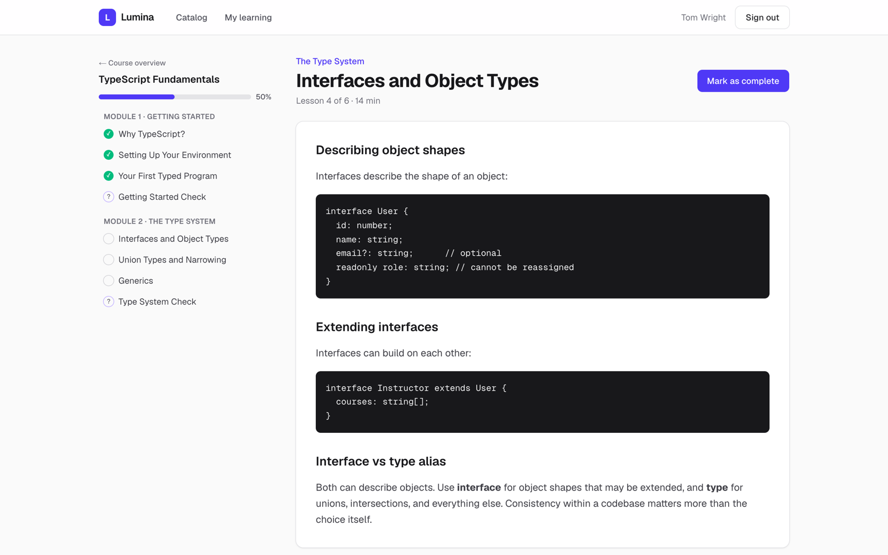
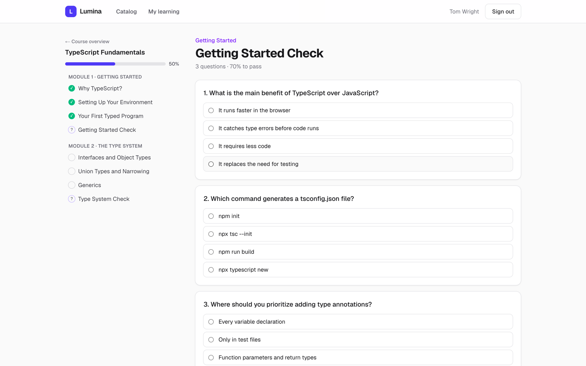
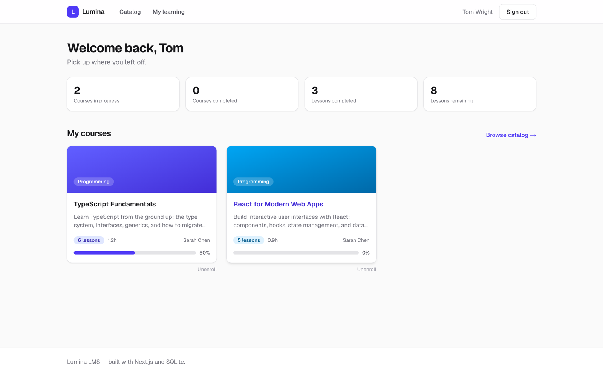
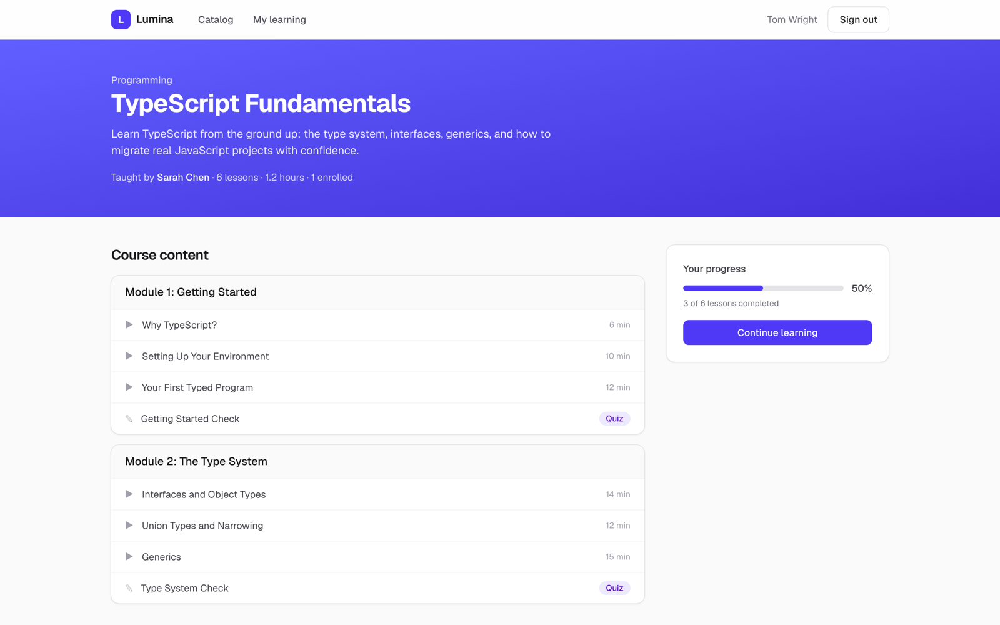
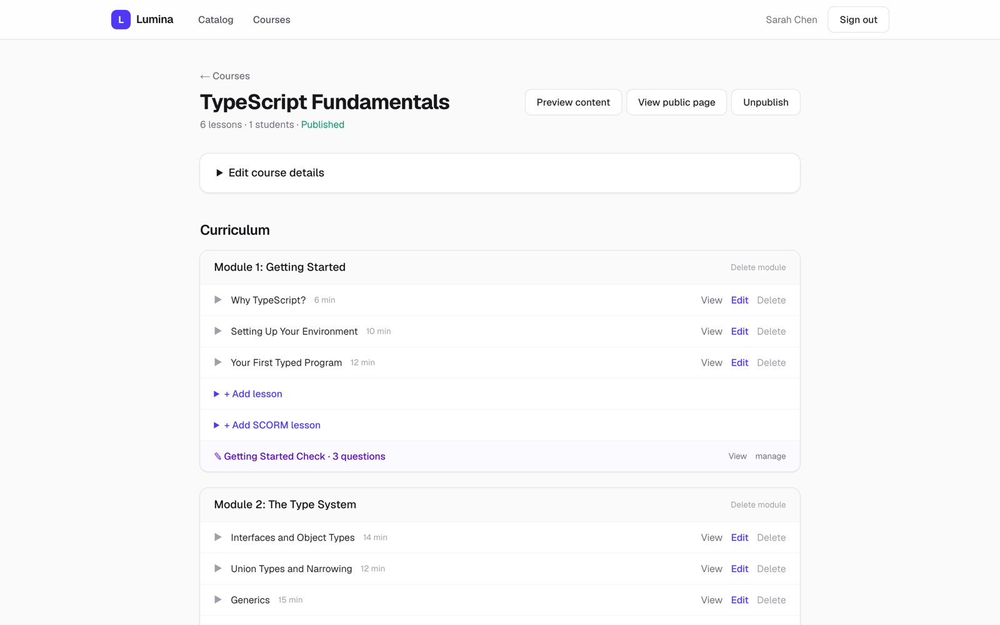
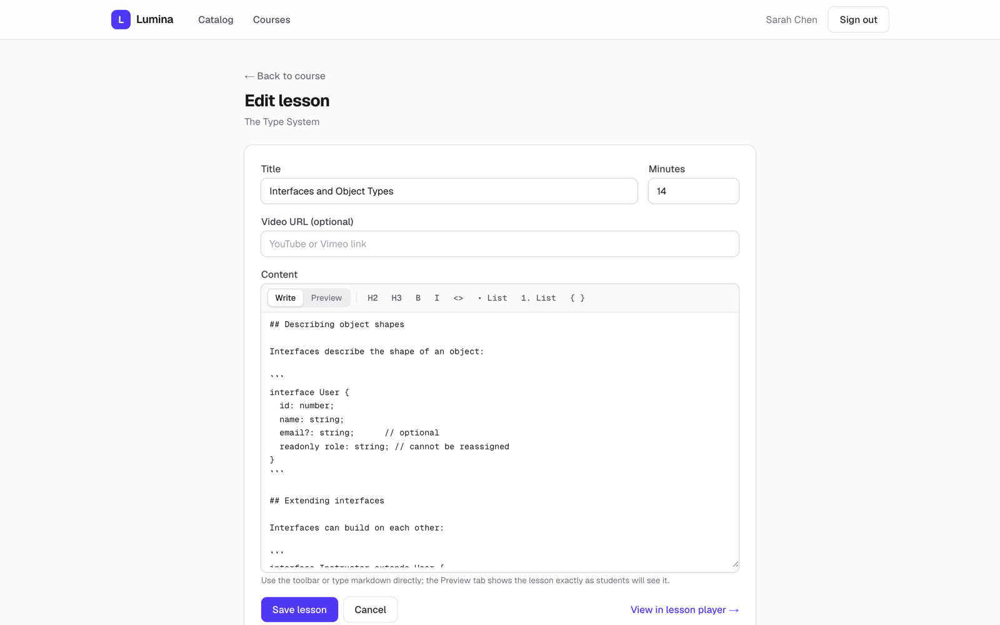
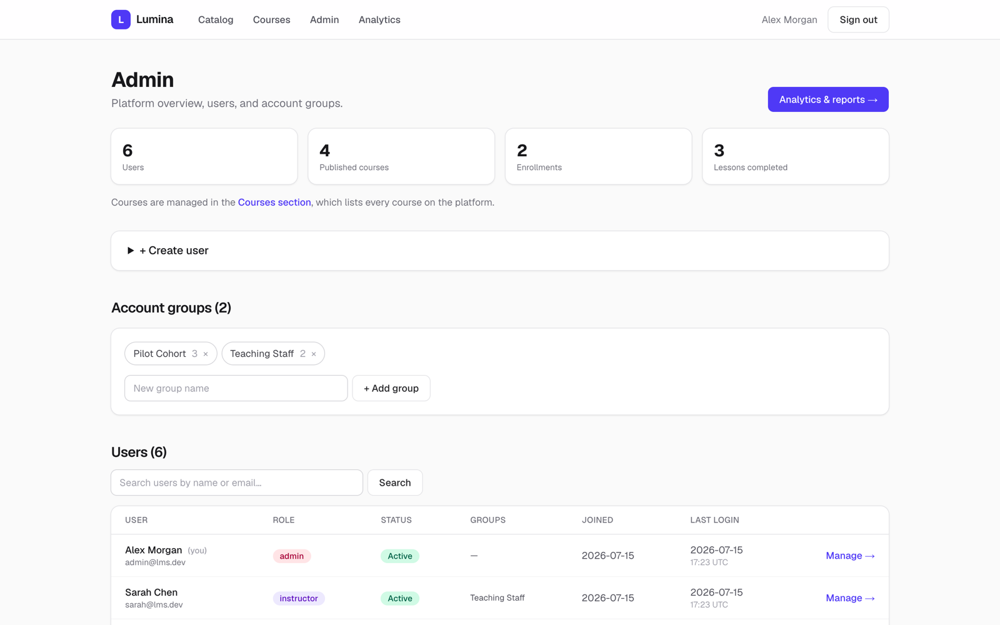
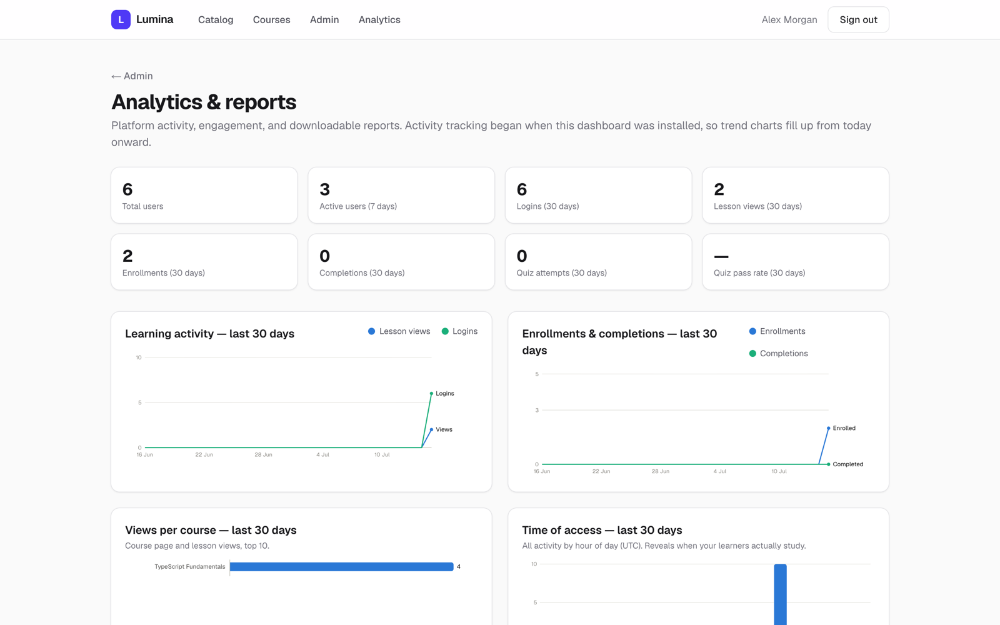

<div align="center">

# Lumina LMS

**A modern, self-contained learning management system.**

Built with Next.js (App Router), TypeScript, Tailwind CSS, and SQLite — no external services required.
The database is a local file, created and seeded automatically on first run.

    



</div>

---

## Why Lumina?

- **Zero infrastructure** — one process, one SQLite file. `npm install && npm run dev` and you have a working LMS with demo content.
- **Batteries included** — courses, quizzes, SCORM, progress tracking, analytics, user management. No plugins to hunt down.
- **Self-hosted and portable** — ships as a slim Docker image with all state in a single volume. Back up one directory and you've backed up everything.

## Features

### 🎓 For learners

| | |
| --- | --- |
|  | **Course catalog** — browse published courses with search and category filters. Each course page shows the full content outline, instructor, and estimated time before you enroll. |
|  | **Distraction-free lesson player** — rich markdown lessons with code blocks, optional YouTube/Vimeo embeds, a course sidebar with completion ticks, mark-complete tracking, and prev/next navigation. |
|  | **Auto-graded quizzes** — multiple-choice checks per module with pass thresholds, per-question feedback, and attempt history. Correct answers never leave the server before submission. |
|  | **Personal dashboard** — enrolled courses with progress bars, completion stats, and a "pick up where you left off" flow. |

<div align="center">

</div>

### ✏️ For instructors

| | |
| --- | --- |
|  | **Course builder** — create courses, structure them into modules, and add lessons and quizzes inline. Publish/unpublish with one click and view per-student progress. Course banners can be a solid colour or an uploaded image. |
|  | **Markdown lesson editor** — a formatting toolbar plus a live Preview tab that renders exactly like the lesson player, so what you write is what students see. |

- **SCORM support** — upload SCORM 1.2 or SCORM 2004 zip packages (Articulate, Captivate, iSpring, …) as lessons. The built-in runtime exposes the SCORM JavaScript API, persists the CMI data model (completion, score, suspend data) for resume, and mirrors completion into normal lesson progress.
- **SCORM library** — upload a package once, attach it to any number of courses, see per-package usage, and safely delete unused packages. Deletion is blocked while lessons still reference a package.
- **Course review schedules** — give each course a review period (3/6/12/24 months). A staff review dashboard flags what's overdue or due soon, tracks last-reviewed and last-updated timestamps, and offers one-click "Mark reviewed".
- **Enrollment policies** — courses are either open to self-enrollment or "by allocation only": staff assign individual students or whole account groups, and allocation-only courses hide the enroll button behind an explanatory note.
- **Recycle bin** — deleting a course soft-deletes it. Content and student progress are preserved, and courses can be restored or permanently purged later.
- **Staff preview** — instructors and admins never enroll: every course on the platform is viewable directly in a clearly marked preview mode, while managing stays limited to the owning instructor or an admin.

### 🛡️ For admins

| | |
| --- | --- |
|  | **User management** — create users, change roles, enable/disable accounts (live sessions end immediately), reset passwords, and organise users into account groups for bulk course allocation. |
|  | **Analytics & reports** — platform activity at a glance: active users, logins, lesson views, enrollments, completions, quiz pass rates, trend charts, and per-course engagement — each downloadable as CSV. |

### ⚙️ Platform

- **Auth & roles** — email/password accounts with HMAC-signed cookie sessions; student, instructor, and admin roles enforced server-side.
- **Single-file database** — SQLite via `better-sqlite3`, with schema migration and demo seeding handled automatically on first request.
- **No client-heavy stack** — server components fetch data directly; small client components handle interactivity; a dependency-free markdown renderer displays lesson content.

## Quick start

```bash
npm install
npm run dev
```

Open http://localhost:3000. The SQLite database (`data/lms.db`) is created and seeded with demo courses and users on first request.

### Demo accounts

All demo accounts use the password `password123`:

| Email | Role |
| --- | --- |
| `student@lms.dev` | Student (enrolled in two courses with some progress) |
| `sarah@lms.dev` | Instructor (owns two courses) |
| `james@lms.dev` | Instructor (owns two courses) |
| `admin@lms.dev` | Admin |

## Architecture

- `lib/db.ts` — SQLite connection, schema migration, and first-run seeding
- `lib/auth.ts` — HMAC-signed cookie sessions and role guards
- `lib/data.ts` — typed read queries
- `lib/actions.ts` — server actions for every mutation (auth, enrollment, progress, quiz grading, authoring, admin)
- `app/` — App Router pages; server components fetch data directly, small client components handle interactivity
- `components/` — shared UI, including a dependency-free markdown renderer for lesson content

Set `SESSION_SECRET` in the environment for production deployments. In production
(`NODE_ENV=production`) the app **requires** it and will refuse to sign sessions
without it — generate one with `openssl rand -base64 32`.

## Production build

```bash
npm run build
npm start
```

## Docker

The app ships as a self-contained image built from Next.js [standalone output](https://nextjs.org/docs/app/api-reference/config/next-config-js/output):
a multi-stage build that compiles the native SQLite module, then copies only the
runtime server, static assets, and `public/` into a slim Debian base that runs as
an unprivileged user. Pushes to `main` and version tags publish the image to
GitHub Container Registry (`ghcr.io/authortom/lumina-lms`).

All state — the SQLite database, extracted SCORM packages, and uploaded images —
lives under `/app/data`, which is exposed as a volume so it survives container
restarts and image upgrades.

### With Docker Compose (recommended)

The published image means you can deploy on any server with Docker — no source
checkout, no local build. You need just two files side by side: `compose.yaml`
and a `.env` holding your `SESSION_SECRET`.

```bash
# Fetch the compose file
curl -fsSL https://raw.githubusercontent.com/authorTom/lumina-lms/main/compose.yaml -o compose.yaml

# Create .env and set a strong session secret
printf 'SESSION_SECRET=%s\n' "$(openssl rand -base64 32)" > .env

# Pull the prebuilt image and start
docker compose pull
docker compose up -d
```

The app is served on http://localhost:3000. Compose automatically reads the
sibling `.env` for `SESSION_SECRET`. Data is stored in the named volume
`lumina-data`; the database is created and seeded on first request. Run
`docker compose ps` — the container shows `healthy` once it's ready.

Deploying through a UI such as **Dockge** or **Portainer**? Paste the contents
of `compose.yaml` into the stack editor and add `SESSION_SECRET` in the stack's
environment/`.env` field. The stack pulls `ghcr.io/authortom/lumina-lms:latest`
directly — nothing is built on the server.

To upgrade later: `docker compose pull && docker compose up -d`.

#### Build from source instead

To build the image locally rather than pull it, edit `compose.yaml` — comment
out the `image:` line and uncomment the `build:` block — then run from a full
checkout of this repository:

```bash
cp .env.example .env          # then set SESSION_SECRET in .env
docker compose up -d --build
```

### With plain Docker

```bash
docker build -t lumina-lms .
docker run -d --name lumina \
  -p 3000:3000 \
  -e SESSION_SECRET="$(openssl rand -base64 32)" \
  -v lumina-data:/app/data \
  lumina-lms
```

Notes:

- **`SESSION_SECRET` is required** — the container starts, but signing a session
  (logging in) throws without it. Keep the value stable across deploys, or all
  existing sessions are invalidated.
- **Back up the volume**, not the container — everything persistent is in
  `/app/data`.
- The image defines a `HEALTHCHECK`; `docker ps` shows `healthy` once it's ready.
- Uploads are capped at 200 MB (SCORM) via the server action body-size limit; put
  a reverse proxy in front for TLS and its own request-size limits in production.
